# Jarkom-Modul-4-2025-K44

| No | Nama                    | NRP       |
|----|-------------------------|-----------|
| 1  | Ahmad Yazid Arifuddin  | 5027241040 |
| 2  | Tiara Fatimah Azzahra  | 5027241090 |

## Catatan Soal Modul 4 
Soal shift dikerjakan pada Cisco Packet Tracer dan GNS3 menggunakan metode perhitungan CLASSLESS yang berbeda.
Keterangan: Bila di CPT menggunakan VLSM, maka di GNS3 menggunakan CIDR atau sebaliknya

# CIDR
## Gambar Topologi CIDR 
Berikut gambar topologi GNS3 (CIDR)
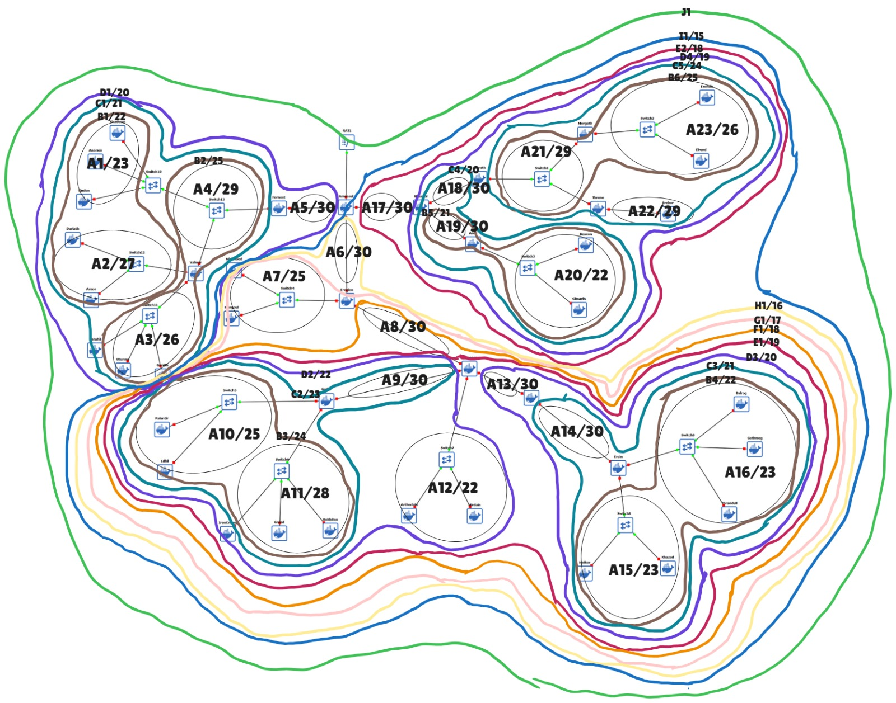

## Gambar Tree CIDR
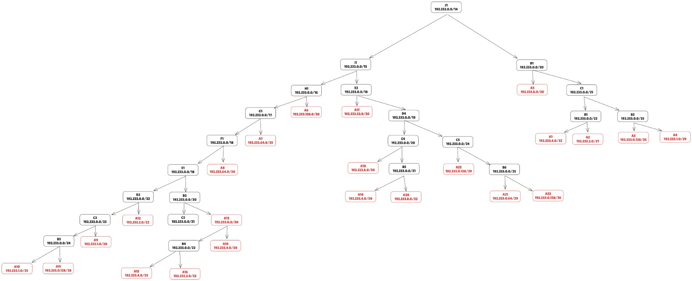

## Pembagian IP-CIDR
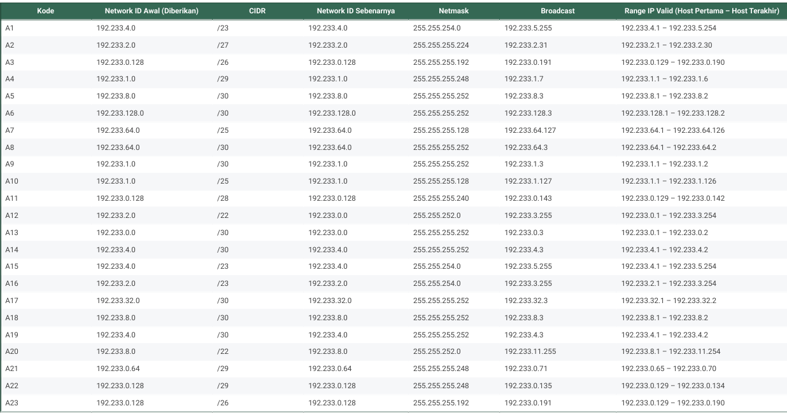

## Penggabungan - CIDR (I)
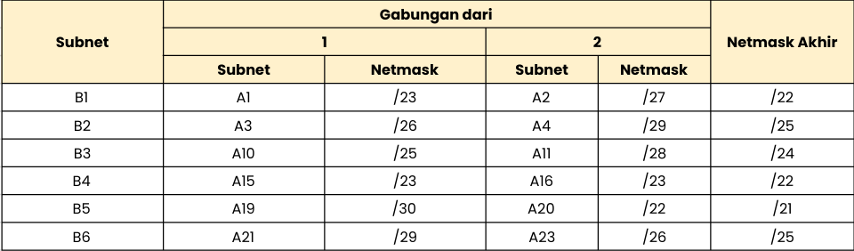

## Penggabungan - CIDR (II)
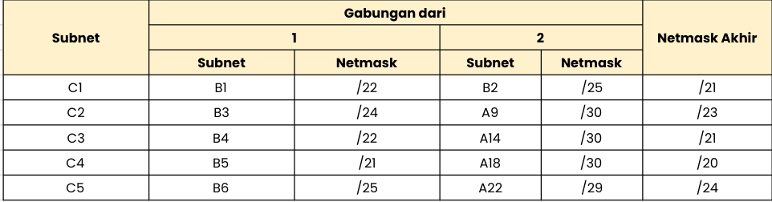

## Penggabungan - CIDR (III)
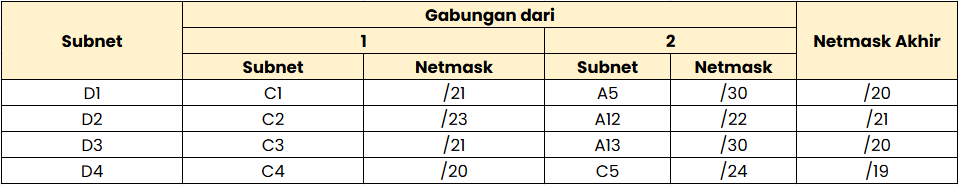

## Penggabungan - CIDR (IV)
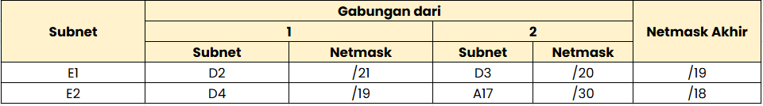

## Penggabungan - CIDR (V)
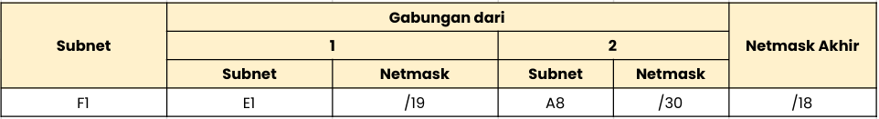

## Penggabungan - CIDR (VI)

## Penggabungan - CIDR (VII)
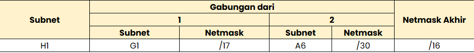

## Penggabungan - CIDR (VIII)
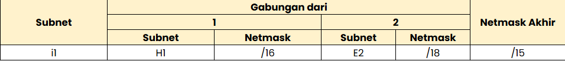

## Penggabungan - CIDR (IX)
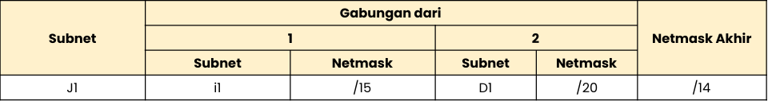

# VLSM
## Gambar Tree VLSM

## Pembagian IP VLSM

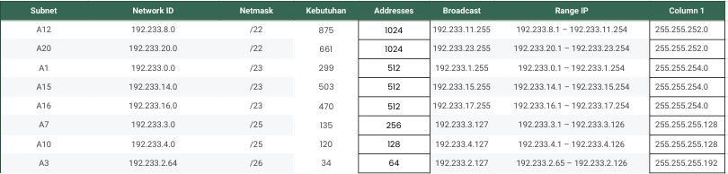

